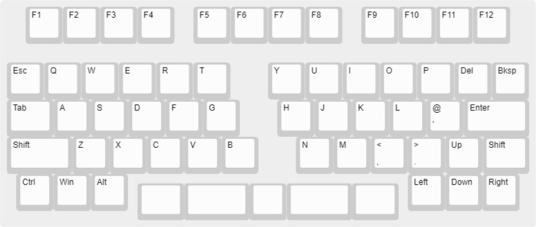
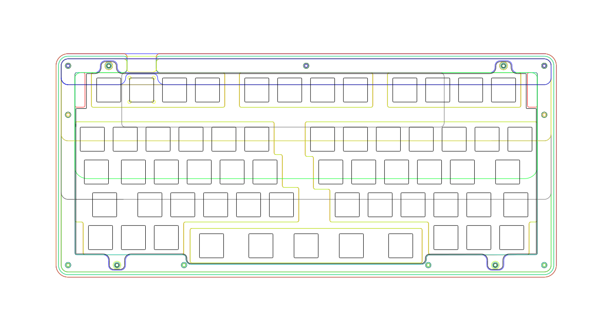
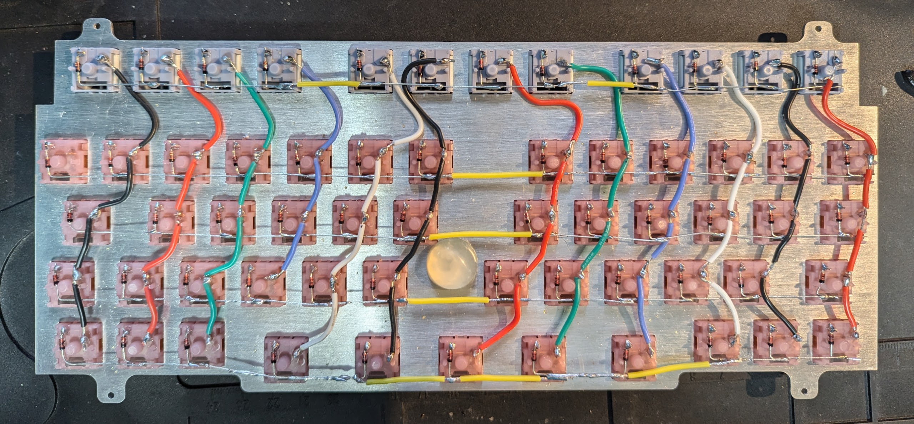

# Barghest Keyboard

Stacked acrylic keyboard case designed for handwiring with a <a href="https://www.waveshare.com/wiki/RP2040-Tiny" target="_blank">Waveshare RP2040-Tiny</a>. Iterated from <a href="https://p3dstore.notion.site/P3Dstore-Open-Source-Project-List-6e85900337294e769fb7b8fa68d68f27" target="_blank">P3D Jake's Hydra Invisibolt case</a> which was designed for <a href="https://mechvault.net/" target="_blank">MechVault's</a>  Hydra PCB. Thanks Jake for allowing me to open source this after I took his Hydra case designed and <s>ruined</s> modified it. Thanks Cain at MechVault for the layout inspiration. If you decide to make one of these then consider donating to <a href="https://buymeacoffee.com/p3dstore" target="_blank"> Jake's coffee fund</a>.

Feel free to do whatever you want with the files. If you have any questions just ask (Discord username elkinoflop) and if you make one then share a photo with me!

Differences from the original
<ul>
  <li>Added F-Row with accents to the side</li>
  <li>Removed the 'invisibolt' part so there are now visible bolts on the top</li>
  <li>Added extra foot layer</li>
  <li>Added cutout to the base to allow a bit more space for handwiring</li>
  <li>Added mounting points for the daughterboard</li>
  <li>Slightly reshaped the feet and front edge</li>
  <li>Only a single (stabless) layout</li>
  <li>Changed from gasket to bottom mount</li>
</ul>

<h1>Layout</h1>

<h1>KLE Raw Data</h1>
[{x:0.5},"F1","F2","F3","F4",{x:0.5},"F5","F6","F7","F8",{x:0.5},"F9","F10","F11","F12"],
[{y:0.5},"Esc","Q","W","E","R","T",{x:1},"Y","U","I","O","P","Del","Bksp"],
[{w:1.25},"Tab","A","S","D","F","G",{x:1},"H","J","K","L","@\n'",{w:1.75},"Enter"],
[{w:1.75},"Shift","Z","X","C","V","B",{x:1},"N","M","<\n,",">\n.","Up",{w:1.25},"Shift"],
[{x:0.25},"Ctrl","Win","Alt",{x:7.5},"Left","Down","Right"],
[{y:-0.75,x:3.5,a:7,w:1.25},"",{w:1.75},"","",{w:1.75},"",{w:1.25},""]

<h1>Case Manufacturing</h1>
<ul>
  <li>Designed to be cut from 3mm acrylic</li>
  <li>I have included 2 variants of the layers 9 & 10. A standard version for use with a PCB and a handwire/HW version with mounting points for a daughterboard</li>
  <li>There are multiple versions of the top layer (1) with different accents to the side of the F-Row</li>
  <li>If you want more space in the case you could double up on one of the layers (I would recommend 4). I didn't do this but depending on how bulky your handwiring is you might find the case tight for space</li>
  <li>As a rough idea of cost <a href="https://mechboards.co.uk/" target="_blank">Mechboards.co.uk</a> was the best price I could find in the UK to get the acrylic cut at around £65-£75 depending on what acrylic you choose</li>
</ul>

<h1>Bill of Materials</h1>
<ul>
  <li>One of each DXF file (except for the plate) cut from 3mm acrylic.</li>
  <li>Plate DXF file cut from 1.5mm metal/carbon. Plastic is not suggested as it will be too flexy and your switches will probably pop out</li>
  <li>A single 8-9mm thick silicone rubber foot/bumpon or similar. Even with a stiffer plate it will still sag in the middle when built handwired. Extra mounting points could be added to fix this but I had already got a plate cut! This Bumpon is stuck to the under side of the plate (between the B and N keys) to support the plate. If a PCB is used this shouldn't be required. <a href="https://amzn.eu/d/alt0xP1" target="_blank">Amazon rubber feet</a></li>
  <li><a href="https://www.waveshare.com/wiki/RP2040-Tiny" target="_blank">Waveshare RP2040-Tiny</a></li>
  <li>M2 Standoffs with a outside diameter of 3mm. 16, 8 and 6mm lengths. <a href="https://amzn.eu/d/8H1HG6Y" target="_blank">Amazon Standoffs</a></li></li>
  <li>M2 Hex socket button head bolts. 5, 6 and 8mm lengths. <a href="https://www.aliexpress.com/item/32969042589.html" target="_blank">AliExpress bolts</a></li>
  <li>M2 Washers. To go under the bolt heads that hold the daughterboard in. These might not be required. <a href="https://www.aliexpress.com/item/1005003697132040.html" target="_blank">AliExpress M2 0.5mm thickness plastic washers</a></li>
<li>M2 nuts to hold the daughterboard. Included with the standoffs linked above</li>
  <li>Optional - WS2812B LEDs. There's enough pins on the controller to add some RGB if you want</li>
  <li>Wire! Solid core 22 AWG suggested</li>
  <li>Optional - Headers (right angle, single row, 2.54mm pin pitch) and dupont wires so the controller can easily be unplugged if required. <a href="https://thepihut.com/products/thepihuts-jumper-bumper-pack-120pcs-dupont-wire" target="_blank">The Pi Hut Dupont wires</a></li>
  <li>60x MX Switches</li>
  <li>60x 1N4148 Diodes</li>
</ul>

<h1>Firmware</h1>
I used <a href="https://github.com/JanLunge/pog" target="_blank">POG</a>  to create <a href="https://github.com/KMKfw/kmk_firmware" target="_blank">KMK</a> firmware. POG makes creating firmware super simple but I might learn how to create QMK/VIAL firmware at some point!
I have included my firmware files (generated by POG). 

If you have wired up the matrix and connected it to the same controller pins as I have then you should be able to use my firmware. Install <a href="https://circuitpython.org/board/waveshare_rp2040_tiny/" target="_blank">Circuit Python</a> onto the controller first and then copy all the unzipped files from <a href="https://github.com/ElKinoflop/Barghest/blob/main/firmware/POG%20Drive%20Contents.zip" target="_blank">'firmware'</a> onto the drive.

<h1>Handwired Matrix</h1>
This is how I handwired the Matrix. Excuse the poor soldering (and out of focus photo), it was my first attempt at handwiring. The second photo shows the controller and LEDs wired up too. I used dupont wires and soldered headers to the controller so they can easily be removed.

<h1>Case Assembly</h1>
If you find some of the standoffs tight to push through don't force them. Use a small round file if you need to slightly widen any holes. The small round file from Draper 'Soft Grip Needle File Set, 140mm (6 Piece) (83982)' is the perfect size.

<h1>PCB</h1>
There is a PCB by ShrimpedKeyboard that uses an external pro micro style RP2040 controller. This PCB is untested.
